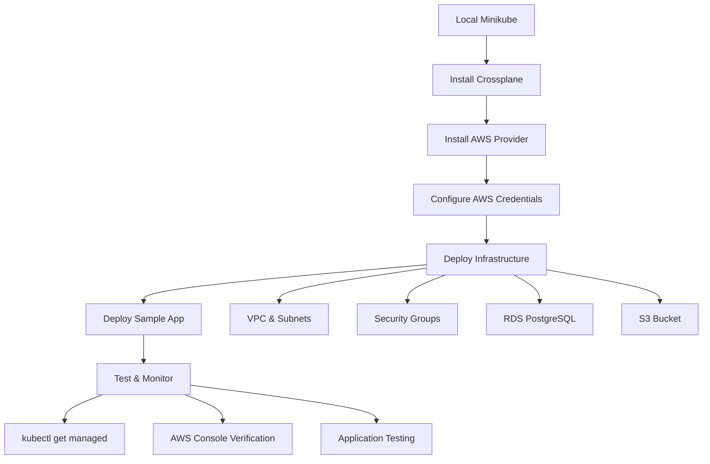

# Crossplane Demo Project - Architecture & Flow

## 🎯 Project Purpose

This project demonstrates **Crossplane's core value proposition**: managing cloud infrastructure through **Kubernetes-native resources** instead of traditional Infrastructure as Code (IaC) tools like Terraform or CloudFormation.

## 🏗️ High-Level Architecture

```
┌─────────────────┐    ┌─────────────────┐    ┌─────────────────┐
│   Developer     │    │   Crossplane    │    │      AWS        │
│   (kubectl)     │───▶│   Controller    │───▶│   Resources     │
└─────────────────┘    └─────────────────┘    └─────────────────┘
         │                       │                       │
         │                       │                       │
         ▼                       ▼                       ▼
┌─────────────────┐    ┌─────────────────┐    ┌─────────────────┐
│   YAML Configs  │    │   K8s Custom    │    │   Real AWS      │
│   (Git Repo)    │    │   Resources     │    │   Infrastructure│
└─────────────────┘    └─────────────────┘    └─────────────────┘
```

## 🔄 Project Flow Overview



## 📋 Infrastructure Components

### **AWS Resources Created**
- **VPC**: `crossplane-demo-vpc` (existing, managed by Crossplane)
- **Subnets**: 2 public subnets in different AZs
- **Security Groups**: 
  - Application security group (HTTP/HTTPS)
  - Database security group (PostgreSQL)
- **RDS Instance**: PostgreSQL database
- **S3 Bucket**: Storage bucket with unique naming
- **Sample Application**: Nginx deployment with LoadBalancer service

### **Kubernetes Resources**
- **Namespace**: `crossplane-system` (Crossplane components)
- **Namespace**: `sample-app` (Application)
- **Secrets**: AWS credentials, RDS password
- **Custom Resources**: All AWS infrastructure as K8s objects

## 🚀 Technical Implementation Phases

### **Phase 1: Platform Bootstrap**
```bash
# Local Kubernetes cluster
minikube start --memory=6144 --cpus=4 --disk-size=20g

# Install Crossplane controller
helm install crossplane crossplane-stable/crossplane

# Install AWS provider (extends K8s API)
kubectl apply -f config/providers/aws-provider.yaml
```

### **Phase 2: AWS Integration**
```bash
# Configure AWS credentials from raj-private profile
kubectl create secret generic aws-creds -n crossplane-system

# Apply provider configuration
kubectl apply -f config/aws/provider-config.yaml
```

### **Phase 3: Infrastructure Deployment**
```bash
# Deploy in dependency order:
kubectl apply -f config/infrastructure/vpc.yaml          # 1. Networking
kubectl apply -f config/infrastructure/subnets.yaml
kubectl apply -f config/infrastructure/security-groups.yaml  # 2. Security
kubectl apply -f config/infrastructure/rds-subnet-group.yaml # 3. Database prep
kubectl apply -f config/infrastructure/rds-instance.yaml     # 4. Database (10-15 min)
kubectl apply -f config/infrastructure/s3-bucket.yaml       # 5. Storage
```

### **Phase 4: Application Deployment**
```bash
# Deploy sample application
kubectl apply -f config/applications/sample-app.yaml

# Access via multiple methods
kubectl port-forward -n sample-app svc/sample-app-service 8080:80
minikube service sample-app-service -n sample-app --url
```

## 🎓 Key Crossplane Concepts Demonstrated

### **1. Managed Resources**
Direct AWS resource representations in Kubernetes:
```yaml
apiVersion: rds.aws.crossplane.io/v1alpha1
kind: RDSInstance
metadata:
  name: crossplane-demo-rds
spec:
  forProvider:
    engine: postgres
    engineVersion: "13.22"
    dbInstanceClass: db.t3.micro
```

### **2. Provider Pattern**
- AWS Provider adds 200+ AWS resource types to Kubernetes API
- Providers handle authentication, API calls, and state management
- Multiple cloud providers can coexist

### **3. Declarative Management**
```bash
# Same interface for everything
kubectl apply -f infrastructure/     # Deploy
kubectl get managed                  # Monitor
kubectl delete -f infrastructure/    # Cleanup
```

### **4. Kubernetes Integration**
- Infrastructure resources reference K8s secrets
- RBAC controls who can manage what infrastructure
- Standard K8s tooling works (kubectl, monitoring, GitOps)

## 💡 Real-World Benefits Demonstrated

### **1. Unified Control Plane**
- Single API (`kubectl`) for applications AND infrastructure
- No context switching between tools
- Consistent RBAC and audit trails

### **2. GitOps Native**
- Infrastructure definitions in Git
- ArgoCD/Flux can manage infrastructure deployments
- Pull-based deployments with drift detection

### **3. Developer Experience**
```bash
# Developers use familiar commands
kubectl get pods                    # Applications
kubectl get rdsinstance            # Databases
kubectl get bucket                 # Storage
kubectl logs crossplane-controller # Infrastructure logs
```

### **4. Operational Simplicity**
- No separate state files to manage
- Kubernetes handles scheduling, retries, and reconciliation
- Standard K8s monitoring and alerting

## 🔍 Crossplane vs Traditional IaC

| Aspect | Terraform | CloudFormation | Crossplane |
|--------|-----------|----------------|------------|
| **Interface** | `terraform apply` | `aws cloudformation deploy` | `kubectl apply` |
| **State Management** | Remote state files | AWS managed | Kubernetes etcd |
| **Monitoring** | External tools | CloudWatch | Native kubectl/K8s |
| **RBAC** | Separate IAM/system | AWS IAM | Kubernetes RBAC |
| **GitOps** | Requires CI/CD setup | Manual/CI/CD | Native ArgoCD/Flux |
| **Multi-Cloud** | Multiple providers | AWS only | Multiple providers |
| **Learning Curve** | Terraform DSL | YAML/JSON | Kubernetes YAML |

## 🧪 Testing & Validation

### **Infrastructure Verification**
```bash
# Kubernetes perspective
kubectl get managed
kubectl describe rdsinstance/crossplane-demo-rds

# AWS perspective  
aws rds describe-db-instances --profile raj-private
aws s3 ls --profile raj-private
```

### **Application Testing**
```bash
# Test connectivity
curl http://localhost:8080
kubectl logs -l app=sample-app -n sample-app
```

## 🎯 Key Takeaways

1. **Infrastructure as Kubernetes Resources**: AWS resources become first-class K8s objects
2. **Unified API**: One interface (`kubectl`) for everything
3. **GitOps Ready**: Native integration with Kubernetes GitOps tools
4. **Developer Friendly**: Familiar Kubernetes patterns and tooling
5. **Production Ready**: Real AWS resources with proper lifecycle management

## 🚀 Next Steps

This demo provides the foundation for:
- **Composite Resources**: Higher-level abstractions (e.g., "Database" that creates RDS + security groups)
- **Multi-Environment**: Different configurations for dev/staging/prod
- **Advanced Compositions**: Complex infrastructure patterns
- **Policy Integration**: OPA Gatekeeper for infrastructure governance
- **Multi-Cloud**: Extending to GCP, Azure providers

---

**This project proves you can manage real AWS infrastructure using nothing but Kubernetes primitives!** 🎉
