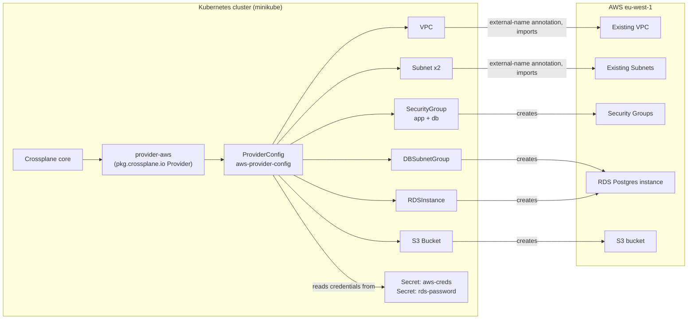

# Crossplane Demo (AWS)

A small demo of provisioning AWS infrastructure through Crossplane instead of Terraform. It's built around resources I already had running in an existing `eu-west-1` (Ireland) account: an existing VPC and two existing subnets, plus a new RDS Postgres instance, a new S3 bucket, and two new security groups, all declared as Kubernetes manifests and reconciled by Crossplane's AWS provider.

There are no Compositions, XRDs, or Claims here. Every resource is a plain Crossplane Managed Resource (`VPC`, `Subnet`, `SecurityGroup`, `DBSubnetGroup`, `RDSInstance`, `Bucket`) applied directly with `kubectl apply`. That's a deliberate scope limitation for a demo repo, not an oversight — see "What's missing" below.

## Architecture



The VPC and subnets aren't created by this repo — they already existed in the account, so the manifests carry a `crossplane.io/external-name` annotation pointing at the real VPC/subnet IDs. Crossplane then "adopts" them and reports their status through `kubectl get vpc` the same way it would for something it created. The RDS instance, S3 bucket, and security groups are actually created and destroyed by Crossplane.

I used Crossplane here instead of Terraform mainly to see what the Kubernetes-native model actually buys you. With Terraform you write HCL, run `plan`/`apply`, and the state lives in a `.tfstate` file (local or remote) that only Terraform understands. With Crossplane, each AWS resource is a CRD, its desired state lives in a YAML manifest, and its current state lives in Kubernetes itself (etcd) as the object's `.status`. That means `kubectl get managed`, `kubectl describe`, and `kubectl diff` work on infrastructure the same way they work on a Deployment, and a GitOps controller like ArgoCD or Flux can reconcile the manifests in this repo continuously instead of needing a separate `terraform apply` step in a pipeline.

The tradeoff is real, though: you now need a running Kubernetes cluster just to manage a VPC and an RDS instance, plus the AWS provider pod has to be installed and made healthy before anything else works, plus credentials have to land as a Kubernetes Secret rather than a profile in `~/.aws/credentials`. For a single RDS instance and an S3 bucket, that's more moving parts than `terraform apply` would need. It only starts paying off once you already run Kubernetes for your workloads and want infrastructure reconciled the same way, or you want drift correction to be continuous rather than something you remember to run.

## Project structure

```
crossplane-demo/
├── config/
│   ├── providers/
│   │   └── aws-provider.yaml       # Provider + ProviderConfig for provider-aws
│   ├── infrastructure/
│   │   ├── vpc.yaml                # Existing VPC, imported via external-name
│   │   ├── subnets.yaml            # Two existing public subnets, imported via external-name
│   │   ├── security-groups.yaml    # App security group (80/443 ingress)
│   │   ├── db-security-group.yaml  # DB security group (5432 from app SG)
│   │   ├── rds-subnet-group.yaml   # DBSubnetGroup for RDS
│   │   ├── rds-secret.yaml         # RDS master password, as a K8s Secret
│   │   ├── rds-instance.yaml       # RDSInstance (Postgres 13.22, db.t3.micro)
│   │   └── s3-bucket.yaml          # S3 bucket with versioning enabled
│   └── applications/
│       └── sample-app.yaml         # Namespace + nginx Deployment + LoadBalancer Service
├── scripts/
│   ├── install.sh                  # Installs Crossplane, the AWS provider, and all manifests above
│   ├── validate.sh                 # Checks provider health, credentials, and resource status
│   └── cleanup.sh                  # Tears down the demo resources (VPC/subnets are only unmanaged, not deleted)
└── ARCHITECTURE.md
```

`sample-app.yaml` is a plain nginx Deployment and Service — it isn't wired to the RDS instance or the S3 bucket, it's there to show that application and infrastructure manifests can live side by side and be applied through the same `kubectl` interface.

## How to run this

This assumes a running cluster (I used minikube) and an AWS account with credentials for `eu-west-1`.

```bash
# 1. Install Crossplane
helm repo add crossplane-stable https://charts.crossplane.io/stable
helm repo update
helm install crossplane crossplane-stable/crossplane \
  --namespace crossplane-system --create-namespace --wait

# 2. Install the AWS provider and its ProviderConfig
kubectl apply -f config/providers/aws-provider.yaml
kubectl wait provider.pkg.crossplane.io/provider-aws --for=condition=Healthy --timeout=5m

# 3. Create the credentials secret the ProviderConfig points at
kubectl create secret generic aws-creds -n crossplane-system \
  --from-literal=creds="[default]
aws_access_key_id=$(aws configure get aws_access_key_id)
aws_secret_access_key=$(aws configure get aws_secret_access_key)
region=eu-west-1"

# 4. Apply infrastructure (order matters: networking/secrets before RDS)
kubectl apply -f config/infrastructure/vpc.yaml
kubectl apply -f config/infrastructure/subnets.yaml
kubectl apply -f config/infrastructure/security-groups.yaml
kubectl apply -f config/infrastructure/db-security-group.yaml
kubectl apply -f config/infrastructure/rds-secret.yaml
kubectl apply -f config/infrastructure/rds-subnet-group.yaml
kubectl apply -f config/infrastructure/rds-instance.yaml
kubectl apply -f config/infrastructure/s3-bucket.yaml

# 5. Apply the sample app (unrelated to the AWS resources above)
kubectl apply -f config/applications/sample-app.yaml

# 6. Check status
kubectl get managed
```

Or use `./scripts/install.sh`, which runs the same steps for the `raj-private` AWS CLI profile. `./scripts/validate.sh` checks provider health and resource status afterward, and `./scripts/cleanup.sh` tears the demo resources back down (it removes the VPC/subnets from Crossplane's management rather than deleting them, since they existed before this demo).

The VPC ID, subnet IDs, and one security group ID in these manifests are hardcoded to real IDs from my AWS account (via `crossplane.io/external-name` annotations and plain string fields). Anyone reusing this repo needs to swap those for their own VPC/subnet/security-group IDs — they won't resolve in a different account.

## What's missing

- No Compositions or XRDs. Every resource is applied and managed individually, so there's no reusable "give me a database" abstraction — you'd write that on top of this if you wanted to expose infrastructure as a self-service claim.
- No CI. There's no pipeline that lints or dry-run applies these manifests before they'd hit a real cluster; `kubectl apply` is a manual step.
- Credentials are static AWS access keys stored as a Kubernetes Secret in plaintext (base64, not encrypted at rest unless the cluster has envelope encryption configured). No IRSA, no Secrets Manager integration, no rotation.
- No RBAC configuration shown — Crossplane and the AWS provider run with whatever permissions the default install grants, and nothing here scopes down who can apply or delete the managed resources.
- No drift detection loop beyond Crossplane's own reconciliation. If something changes the RDS instance out-of-band in the AWS console, Crossplane will eventually reconcile it back, but there's no alerting around that.
- Several resource IDs (VPC, subnets, one security group reference) are hardcoded strings rather than Crossplane resource references (`*Ref`/`*Selector` fields), so the manifests don't automatically pick up IDs from resources created earlier in the same apply — they only work because those specific IDs already exist in my account.
